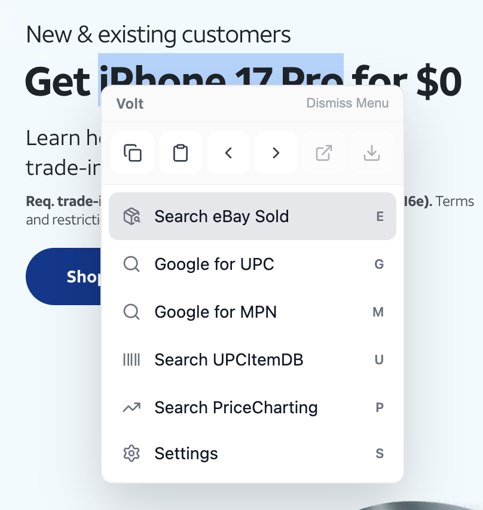

# Volt

Tools for buying and listing electronics, built around the reseller's browser workflow.

Volt combines market search, offer calculation, and listing helpers in a Chrome extension. Its companion iPhone app captures barcodes, text, and photos, with account-based sync to the browser.

[Website](https://volt.juanquenga.com) · [Chrome Web Store](https://chromewebstore.google.com/detail/volt/bmgghhmlflbhlnomgnoodpidekpaaifk) · [iPhone app](https://apps.apple.com/us/app/volt-scanner/id6771770148) · [Contribute](CONTRIBUTING.md)



## What you can do

- Research resale prices with eBay sold-price helpers and market-search shortcuts.
- Calculate offers and use Shopify listing helpers without leaving Chrome.
- Capture barcodes, OCR text, and listing photos on an iPhone.
- Sync captures to your account workspace and insert text into a selected Chrome computer.
- Open tabs, bookmarks, history, and tools from a keyboard-driven command menu.

Volt is actively developed. Chrome's browser tools are free. Signed-in iPhone users can scan and keep local history without Pro; cloud workspace and mobile capture sync require Pro. The App Clip offers temporary, checkout-free capture through a workspace guest grant. See [authentication and billing](docs/authentication-and-billing.md) for the access model.

## Start contributing

Use Node.js 22 or newer and pnpm 10 through Corepack. Chrome is needed for extension work; macOS and Xcode are needed only for native iOS work.

```sh
corepack enable
pnpm install
pnpm --filter @volt/scanner-protocol test
```

That test suite needs no service credentials. See the [contributor guide](CONTRIBUTING.md) to choose a workspace, configure your own development services, and run the relevant checks. Do not use the maintainer's deployment for development.

Start with an [open issue](https://github.com/juanquenga/Volt/issues), or report a reproducible bug. Documentation corrections and regression tests are welcome. Discuss larger changes in an issue before implementing them.

## Repository map

| Workspace | Purpose |
| --- | --- |
| [packages/extension](packages/extension/README.md) | Chrome extension using WXT, React, and TypeScript. |
| `packages/scanner-protocol` | Shared scanner constants, message types, and validation. |
| `apps/mobile` | Native SwiftUI iPhone app and App Clip. |
| `apps/web` | TanStack Start web app, product pages, and account tools. |
| [convex](convex/README.md) | Account authorization, scanner workspace, cursor delivery, catalog data, and legacy signaling. |

Convex stores capture metadata; private photo bytes go directly to Cloudflare R2 through short-lived signed URLs. The installed app keeps a durable local outbox, so capture does not depend on an online computer.

## Documentation

- [Contributor setup and checks](CONTRIBUTING.md)
- [Current product and domain context](CONTEXT.md)
- [Authentication and billing](docs/authentication-and-billing.md)
- [Architecture decisions](docs/adr)
- [Maintainability notes](docs/maintainability.md)
- [Chrome extension releases](packages/extension/docs/RELEASE_PROCESS.md)
- [iOS releases](apps/mobile/fastlane/README.md)
- [Security policy](SECURITY.md)

## License

AGPL-3.0-or-later. See [LICENSE](LICENSE).
